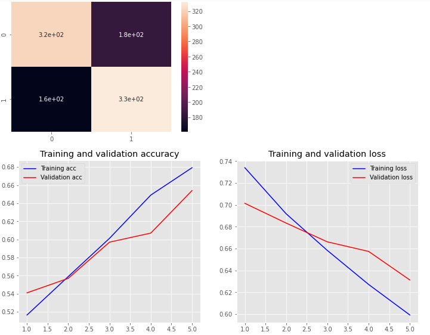

# Neural Networks for NLP
Code to build deep neural networks for Sentient Analysis and NER

```
Training MLP
/usr/local/lib/python3.6/dist-packages/ipykernel_launcher.py:4: UserWarning: The `nb_epoch` argument in `fit` has been renamed `epochs`.
  after removing the cwd from sys.path.
Train on 4000 samples, validate on 1000 samples
Epoch 1/5
4000/4000 [==============================] - 0s 110us/step - loss: 0.7341 - acc: 0.5165 - val_loss: 0.7015 - val_acc: 0.5410
Epoch 2/5
4000/4000 [==============================] - 0s 40us/step - loss: 0.6919 - acc: 0.5590 - val_loss: 0.6834 - val_acc: 0.5570
Epoch 3/5
4000/4000 [==============================] - 0s 39us/step - loss: 0.6583 - acc: 0.6012 - val_loss: 0.6662 - val_acc: 0.5970
Epoch 4/5
4000/4000 [==============================] - 0s 41us/step - loss: 0.6272 - acc: 0.6490 - val_loss: 0.6575 - val_acc: 0.6070
Epoch 5/5
4000/4000 [==============================] - 0s 41us/step - loss: 0.5992 - acc: 0.6793 - val_loss: 0.6313 - val_acc: 0.6540
```

